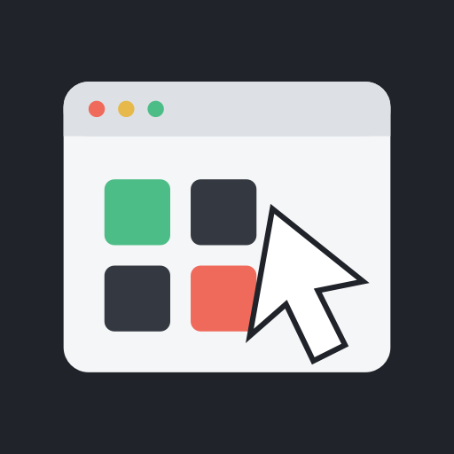
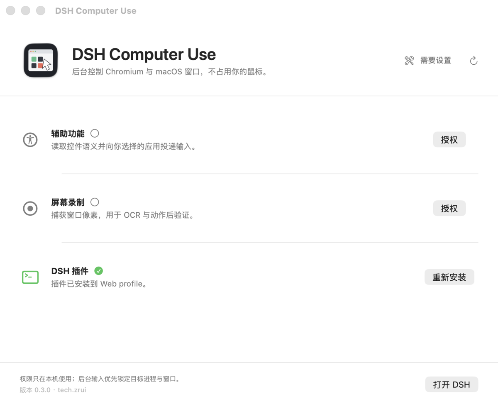

<p align="center">
  
</p>

<h1 align="center">DSH Computer Use</h1>

<p align="center">
  Text-first browser and background macOS control for DSH.<br>
  Target the right process and window without taking over the user's pointer.
</p>

<p align="center">
  <a href="README.zh.md">简体中文</a> ·
  <a href="documentation/architecture.md">Architecture</a> ·
  <a href="documentation/distribution.md">Distribution</a> ·
  <a href="SECURITY.md">Security</a>
</p>

<p align="center">
  
  
  
  
  
</p>

## Install

### Homebrew

```bash
brew tap zrui-c/tap
brew trust zrui-c/tap
brew install --cask dsh-computer-use
open -a "DSH Computer Use"
```

### DMG

1. Download the latest `DSH-Computer-Use-*-universal.dmg` from [Releases](https://github.com/ZRui-C/dsh-computer-use/releases/latest).
2. Drag **DSH Computer Use** into **Applications** and open it.

With either method, authorize **Accessibility** and **Screen Recording**, choose the target under **Install into**, then select **Install** under **DSH Plugin**. Web remains the default; restart its running Host afterward. For the official Desktop App, initialize and fully quit it before installing, then reopen it.

The Homebrew Cask and official DMG install the same Universal 2, Developer ID signed, Apple-notarized app. Users do not need Xcode, Swift, or this source checkout. DSH (CLI or the official Desktop App) and Google Chrome must already be installed.

<p align="center">
  
</p>

## What it does

| Surface | Perception | Input |
| --- | --- | --- |
| Chromium | Playwright, CDP accessibility/DOM, frames, tabs, optional OCR | Ref-pinned navigation, pointer, keyboard, forms, scroll, drag, upload |
| macOS | Accessibility tree first, Vision OCR for semantic gaps, independent window capture | AX actions, targeted SkyLight/CoreGraphics, global HID only without a target |

Every action returns a fresh bounded text observation. The model works with roles, names, values, state, geometry, and stable snapshot refs instead of assuming it can inspect screenshots. UI and OCR strings are explicitly untrusted data.

### Background macOS control

- Carries PID, WindowServer window ID, AX window frame, and element identity through every action.
- Prefers semantic AX actions before coordinate input.
- Routes supported pointer and keyboard events directly to the target process/window.
- Uses a click-through software cursor; targeted actions do not move the physical pointer.
- Keeps post-action observation pinned to the previous target, even while another app stays active.
- Falls back to public CoreGraphics or fails closed when a private capability is unavailable.

## Platform boundary

ScreenCaptureKit is public API. The optional background input path dynamically loads private SkyLight symbols and is intended for Developer ID distribution, not the Mac App Store. Private APIs are unsupported by Apple and can change between macOS releases.

On macOS 26, Stage Manager may expose a shelved window only as a small WindowServer thumbnail. Constructing a capture filter for that representation can abort inside SkyLight. DSH Computer Use detects the geometry mismatch first, preserves AX observation, returns an explicit warning, and never stretches a thumbnail into a fake full-window screenshot.

## DSH integration

The embedded package declares a DSH bundle in `package.json`. The default **Web / DSH for Mac** target runs the official equivalent of:

```bash
dsh plugin --profile web add --save-exact file:/path/to/DSH\ Computer\ Use.app/Contents/Resources/Plugin
```

`cordis.patch.yml` installs the Host runtime and registers `computer_observe` / `computer_action` in DSH's global tool layer, inherited by every agent preset. No manual edits to user profile YAML or preset copies are required. The setup center detects an older dependency-only installation and repairs the missing bundle registration. A running DSH Host must be restarted after install, repair, or upgrade.

### Official DeepSeek Harness Desktop App

Choose **Official DeepSeek Harness App** in the setup center. This installs into the App's separate `desktop` profile; a successful Web install does not mean the App has the plugin.

1. Install and launch the official DeepSeek Harness App once to initialize its profile.
2. Fully quit it with **Command-Q**. Closing its window only hides it. Finish other plugin/CLI operations before installing or updating either app.
3. Open DSH Computer Use, select the official App target, and install. It discovers `DeepSeek Harness.app` in `/Applications` or `~/Applications`. Use **Choose…** for a moved/renamed App or its bundled command; `DSH_DESKTOP_EXECUTABLE` can also identify that command.
4. Reopen the official App. **Open DSH** opens the selected application, without assuming a fixed Host port.

The installer invokes the App's own launcher, without requiring its optional terminal-command registration:

```bash
"/Applications/DeepSeek Harness.app/Contents/Resources/runtime/cli/bin/dsh" \
  plugin --profile desktop add --save-exact \
  "file:/Applications/DSH Computer Use.app/Contents/Resources/Plugin"
```

It does not edit profile manifests itself, boot the reserved Desktop profile through the CLI, use npm-installed `dsh` for Desktop, or bypass profile locks. Install/repair status is read from the selected profile under `DSH_HOME` (default `~/.dsh`), and launcher choices are remembered separately. Use the same `DSH_HOME` as the Host you intend to configure. Status inspection and the Desktop launcher use the setup app's environment. Web installation retains its login-shell environment; if your shell alone sets a custom `DSH_HOME`, launch the setup app with that same environment so its status display reads the correct profile.

**DSH for Mac** is a different SwiftUI client and uses the **Web / DSH for Mac** target for its local `web` Host. When it connects to an external Host, install the plugin on that Host's Mac instead. Installing locally does not add computer access to a remote Host.

Both modes load the same host-side tools. Desktop authentication and its random HTTP port need no workaround: the plugin uses DSH services inside the Host. The separate **DSH Computer Use.app** still owns Accessibility and Screen Recording permissions and launches through macOS LaunchServices. No new permission is requested automatically by switching targets.

If using the official App's plugin dialog instead, put the local package path in the **package** field. The **Registry** field is for an npm registry (for example `https://registry.npmjs.org/`), not a GitHub repository URL. The embedded compiled package is the supported install source; this repository is not an npm-published package.

Compatibility references: [upstream Desktop installation ownership and command runtime](https://github.com/deepseek-ai/deepseek-harness/blob/dsh-v0.2.1-alpha.1/apps/desktop/README.md#bundled-command-runtime), [DSH for Mac connection modes](https://github.com/ZRui-C/dsh-for-mac#连接方式). The adapter targets the verified `0.2.0-rc.2` and `0.2.1-alpha.1` Desktop contracts; older Desktop builds lacking this launcher must be upgraded. macOS GUI, TCC authorization, and a real installed Desktop end-to-end flow still require manual acceptance; unit tests and CI builds do not establish those results.

## Build from source

Requirements: macOS 14+, Xcode/Swift 5.9+, Node.js 22+, pnpm 11+, DSH, and Google Chrome.

```bash
pnpm install
pnpm run typecheck
pnpm run test
pnpm run test:native
pnpm run build
```

`pnpm run build` creates:

```text
native/macos-helper/dist/DSH Computer Use.app
```

The default build is Universal 2. For faster local iteration:

```bash
COMPUTER_USE_ARCHS=arm64 pnpm run build
```

Create a local drag-to-Applications DMG:

```bash
pnpm run package:dmg
```

Public releases require a `Developer ID Application` identity and notarization. See [documentation/distribution.md](documentation/distribution.md) for the exact local and GitHub Actions flows.

## OCR languages and bounded desktop observations

OCR detects languages automatically by default. Set `ocrLanguages` on the `computer-use-host` configuration to an ordered list of Vision language identifiers, for example `["zh-Hans", "en-US"]`, to prefer Simplified Chinese and English. The same setting applies to desktop capture, display fallback, and browser OCR. Unsupported language identifiers produce an explicit OCR warning/error rather than silently dropping text; supported languages depend on the installed macOS version.

Desktop AX traversal supports up to 64 levels and at most 2,000 nodes (`maxNodes` still defaults to 250 in the host). Depth/node cutoffs set `truncated` and include a warning. A bounded observation may still omit controls; narrow the view or observe again instead of guessing refs.

Development dependencies target DSH `0.2.1-alpha.1`. Explicit peers also accept `0.2.0-rc.2`, and the earlier `0.1.0-rc.6` peer ranges remain accepted. CI checks isolated dependency trees for all three versions (`node scripts/test-compat.mjs <version>`): TypeScript typecheck/build and non-browser contract tests. This does not imply that every intervening DSH version or macOS runtime has been tested.

## Tool contract

`computer_observe` returns `interactive`, `full`, or `changes` snapshots for `browser` and `desktop`, with optional query filtering and `auto | always | never` OCR.

`computer_action` performs exactly one browser or desktop action and returns the post-action semantic state. Ref and coordinate actions require the latest `snapshot_id`; stale targets fail closed and require another observation. File uploads are fenced to the DSH session workspace.

## Project

- [Architecture](documentation/architecture.md)
- [Distribution and notarization](documentation/distribution.md)
- [Security policy](SECURITY.md)
- [Contributing](CONTRIBUTING.md)
- [Changelog](CHANGELOG.md)
- [Third-party notices](THIRD_PARTY_NOTICES.md)

## Community

- [GitHub Discussions](https://github.com/ZRui-C/dsh-computer-use/discussions) — ask questions, share usage, report ideas
- [DeepSeek Harness Discord](https://discord.gg/Ycq5dCaS4) — the wider DSH ecosystem
- Star the repo if DSH Computer Use saves your pointer 🖱️

Licensed under [Apache-2.0](LICENSE). This independent project is not endorsed by Apple. “DeepSeek” and related marks belong to their respective owners; the name is used only to describe compatibility with DeepSeek Harness/DSH.
